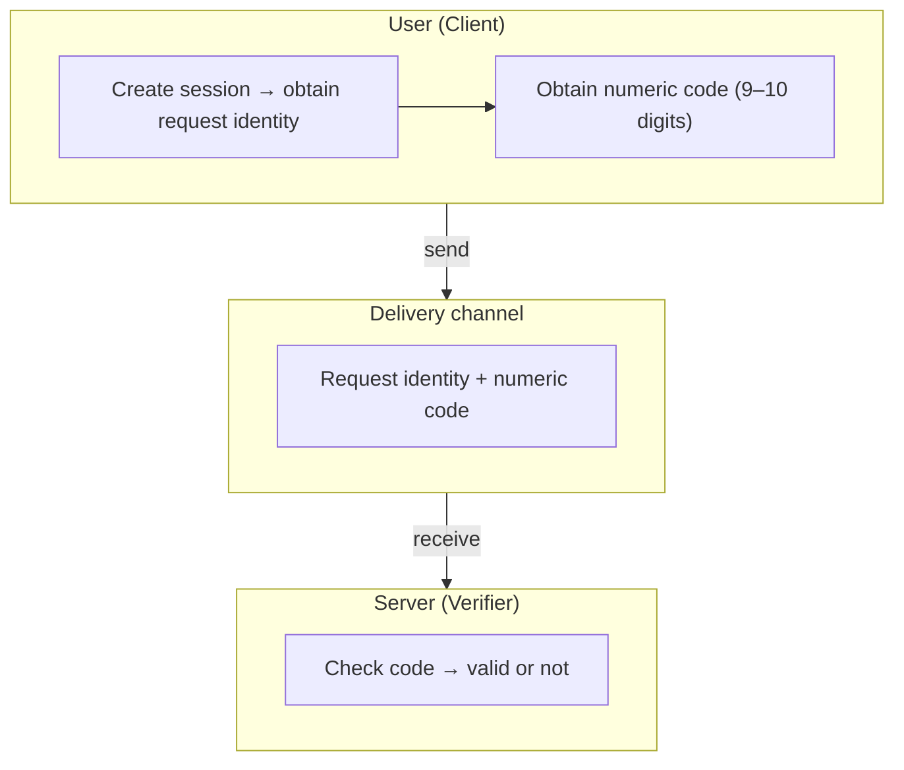
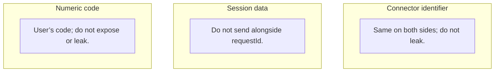

# Use Case Scenarios

This document describes the flow and the parties involved.

## Parties Involved

| Party                 | Role                            | What they use                                                                                               | What they do                                                                                                        |
| :-------------------- | :------------------------------ | :---------------------------------------------------------------------------------------------------------- | :------------------------------------------------------------------------------------------------------------------ |
| **User (Client)**     | Initiates and requests the code | Connector identifier (`connectorId`), session data (`hashId`), request identity (`requestId`), numeric code | Create session, create request, obtain code. Send request identity (`requestId`) to Server (via QR, link, or form). |
| **Server (Verifier)** | Verifies the code and validates | Same connector identifier (`connectorId`) as the User                                                       | Receive request identity (`requestId`) and numeric code from User. Check that the code is correct and still valid.  |

## Usage Flow

The User requests a code, then sends the **request identity** (`requestId`) to the Server. The User also has a **numeric code** (9–10 digits) that must be entered on the Server side. The Server receives both and checks: if the code matches and is not expired, the verification succeeds.

> **1. User (Client)**
> Creates a session, creates a request, obtains the numeric code. Sends the request identity to the Server (e.g. via QR or link). The numeric code is shown to the User to be typed at the Server.

> **2. Delivery channel**
> What is transmitted: request identity (`requestId`) and numeric code. Can be via QR, link, form, or other means. The Server only receives these two; it does not receive session data (`hashId`) separately.

> **3. Server (Verifier)**
> Receives the request identity (`requestId`) and the code the User types. The Server **only** calls `verify(requestId, code)`; it does not call `decode`. If the code matches and is not expired, verification succeeds.

**Flow overview**

## Delivery Channel and Data

**Delivery channel** = how data gets from the User to the Server. It is not an application or another system; only the “path” for transmission. What is sent: **request identity** (`requestId`) and **numeric code**. Example: User scans a QR (containing `requestId`), then types the code on the Server screen; or fills a form that submits both at once.

| What is sent                                  | What the Server receives             | Session data (`hashId`)                  |
| :-------------------------------------------- | :----------------------------------- | :--------------------------------------- |
| Request identity (`requestId`) + numeric code | Both (without separate session data) | Obtained by Server from `requestId` only |

The Server never receives session data (`hashId`) via a separate transmission; `hashId` exists only inside `requestId` and can only be read by a Server that has the same connector identifier (`connectorId`).

## Session Data `hashId` and Its Link to the User

**`hashId`** can be used as an identifier tied to the user. Conceptually it is an identifier per user/per device: **decode** is only on the **client** side. Every request decoded with the same `hashId` is from the same “user” (the session or identity you define in the application). Decode only on the client; the verifier does not call `decode`. If the client sends `hashId` (e.g. in a URL), the verifier can use it to correlate the origin of the request.

- **One-time per session:** By default, `generate(connectorId)` produces a new `hashId` on each call (timestamp + nonce). Suitable when each session should be truly anonymous and not traceable to other sessions.
- **Stable per user:** The application can call `generate(connectorId)` once (e.g. at onboarding or login), then store and reuse the same `hashId` for every request from that user. The verifier then treats that `hashId` as the user’s “user ID” or “channel”.

With **stable per user**, Trustless-ID can be used for **repeated identity proof**: each time the user proves identity, the client calls `request(hashId, expireTime)` → `decode` → code; the verifier calls `verify(requestId, code)`. The verifier can use `hashId` (from decoding the `requestId` payload if needed) as a consistent identity across sessions — without storing per-user secrets on the server (similar to 2FA without a DB).

The choice of one-time or stable is an application policy; the library does not enforce either. Bear in mind: anyone who sees `hashId` (e.g. from a QR or link) can associate it with the user; for privacy, consider when `hashId` is treated as secret or may be visible.

## Three Things That Must Be Protected

These three are important and their roles:

## Recommended Practices

- **Connector identifier (`connectorId`) must match:** User and Server must use the same `connectorId` (e.g. agreed URL or name). If they differ, the Server cannot verify and verification fails.
- **Wrap with standard cryptography:** Trustless-ID handles connector binding and time-bound proof; it is **not** a replacement for transport security. Always run verification over a secure connection (HTTPS/TLS) or another standard encryption layer (e.g. AES in the application), so that `requestId` and code are not read or forged in transit. Use the library **inside** a channel already protected by standard cryptography.

## Reference

- [USAGE.md](USAGE.md) — API guide and technical flow.
- [README.md](README.md) — Installation and quick start.
